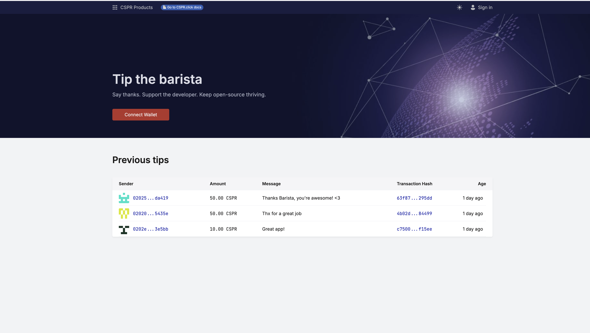

# Tip the Barista Demo dApp

A demonstration application showcasing how to build a full-stack dApp on the Casper Network.
The dApp allows users to send tips with CSPR tokens to a developer to show their appreciation. The tips are stored in a smart contract and indexed by CSPR.cloud. The dApp also provides a list of all tips sent so far.

---

## 📚 New to Casper development?

We also provide a comprehensive, step-by-step tutorial that teaches you how to build this entire dApp from scratch.

→ [**Start the Tutorial: From Idea to dApp in Minutes**](./tutorial/README.md)

…or continue reading this page to set up your local environment and try the demo firsthand.


## What You'll Learn

This demo demonstrates:

- **Authentication & Wallet Integration**: Using CSPR.click, a Web3 authentication layer that integrates with all Casper ecosystem wallets
- **Blockchain Data Indexing**: Using CSPR.cloud, an enterprise-grade middleware platform that provides access to indexed and enriched blockchain data with real-time streaming
- **Smart Contract Development**: Writing contracts with Odra framework
- **Event Handling**: Listening to and indexing smart contract events

### Live Demo

> 🌐 **Try it live:** [donation-demo.casper.network](https://donation-demo.casper.network)

---




## Prerequisites

Before you begin, ensure you have:

- [Docker](https://docs.docker.com/get-docker/) and [Docker Compose](https://docs.docker.com/compose/install/) installed
- [CSPR.build](https://console.cspr.build) account for API access keys
- Node.js and npm (for local development)

## Quick Start with Docker

The fastest way to run the complete application:

1. **Configure environment variables**:
   ```bash
   cp server/.env.example server/.env
   ```
   The default values work for testnet deployment with Docker.

2. **Launch all services**:
   ```bash
   docker compose -f infra/local/docker-compose.yaml --project-name tip-barista up -d
   ```

This starts the database, event listener, API server, and web client.

## Development Setup

### 1. Register for API Access

Create a free account at [CSPR.build](https://console.cspr.build) to obtain:
- CSPR.click application id (for wallet authentication)
- CSPR.cloud access keys (for blockchain data indexing)

### 2. Smart Contract

You have two options:

**Option A: Use the deployed contract** (recommended for testing)
- Package hash: `c447e9d334a710bc3e0a47cbea854c269e41637d7b9aa9d37a745596f651ed7a`
- View on [Testnet Explorer](https://testnet.cspr.live/contract-package/c447e9d334a710bc3e0a47cbea854c269e41637d7b9aa9d37a745596f651ed7a)
- Already configured in default settings

**Option B: Deploy your own contract**
- Follow the [smart contract deployment guide](smart-contract/README.md#deploy-to-testnet)
- Update configuration with your new package hash

### 3. Backend Server

The server includes an event listener and REST API.

**Requirements**:
- MySQL database (use Docker Compose for local development)
- CSPR.cloud API credentials

**Setup**:
1. See detailed instructions in [server/README.md](server/README.md)
2. Configure database connection and API keys
3. Start the event listener to index smart contract events
4. Launch the API server

### 4. Frontend Client

**Setup**:
1. Follow instructions in [client/README.md](client/README.md)
2. Configure CSPR.click credentials
3. Point to your API server endpoint
4. Run the development server

## Architecture Overview

```
                          ┌──────────────────────┐
                          │     Casper Network   │
                          └───────────┬──────────┘
                                      │
                 ┌────────────────────┼────────────────────┐
                 │                    │                    │
                 ↓                    ↓                    ↓
         ┌─────────────────┐   ┌───────────────┐   ┌────────────────┐
         │   CSPR.click    │   │  CSPR.cloud   │   │  CSPR.cloud    │
         │ (Wallet Auth)   │   │ (API + Events)│   │ Streaming API  │
         └─────────────────┘   └───────┬───────┘   └──────┬─────────┘                
                 ↑                     │                  │
                 │                     │                  │
                 ↓                     │                  │
           ┌─────────────┐             │                  │
           │ Web Client  │             │                  │
           └─────────────┘             │                  │
                 ↑                     │                  │
                 │                     │                  │
                 │                     │                  │
           ┌─────────────┐             │                  │
           │  API Server │ <───────────┘                  │
           └─────────────┘                                │
                 ↑                                        │
                 │                                        │
                 │                                        │
           ┌─────────────┐         ┌────────────────┐     │
           │   MySQL DB  │<─────── │ Event Listener │<────┘
           └─────────────┘         └────────────────┘                                 
```


## Project Structure

```
.
├── tutorial/            # 📚 Step-by-step tutorial (START HERE!)
├── client/              # React frontend application
├── server/              # Backend API and event listener
├── smart-contract/      # Odra smart contract source
└── infra/               # Dockerfiles and Docker Compose configuration
```

## About Casper Network

Casper is a Proof of Stake enterprise blockchain designed to help enterprises build blockchain-enabled products and services, featuring upgradeable smart contracts, developer-friendly features, and lower transaction costs than most Layer-1 blockchain offerings. Key features include:

- **Upgradeable Smart Contracts**: Modify contracts post-deployment without complex migrations
- **Developer-Friendly**: Supports Rust and other mainstream languages via WebAssembly
- **Enterprise-Ready**: Multi-signature transactions and weighted key permissions at protocol level
- **Predictable Costs**: Stable gas fees during high network activity

## Resources

- [Casper Network](https://casper.network) - Official website
- [CSPR.build Console](https://console.cspr.build) - Developer tools access
- [CSPR.cloud Documentation](https://docs.cspr.cloud/) - API reference
- [Testnet Explorer](https://testnet.cspr.live) - View transactions and contracts
- [Odra Framework](https://odra.dev/) - Smart contract development
- [CSPR.click Documentation](https://docs.cspr.click) - Unified SDK that simplifies Web3 application onboarding
- [CSPR Design System](https://cspr.design/) - CSPR.suite UI components library for React applications

## Community & Support
Join [Casper Developers](https://t.me/CSPRDevelopers) Telegram channel to connect with other developers.
