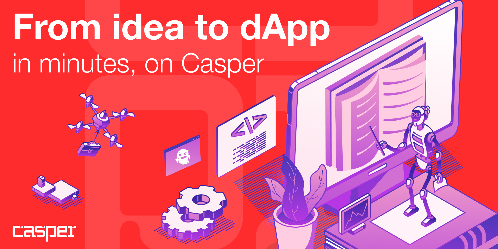

# Building a Full-Stack dApp on the Casper Network

Welcome to the **Donation Demo** tutorial — a complete, step-by-step guide that teaches you how to build a **full-stack decentralized application (dApp)** on the **Casper Network** using modern tools from the **CSPR Suite**.

By the end of this tutorial, you will learn how to:

- Build a **React** frontend with wallet connection using **CSPR.click**
- Write an **Odra smart contract** that accepts donations
- Use **CSPR.cloud** to index blockchain events
- Build a **Node.js backend** that consumes events and exposes a REST API
- Combine everything into a clean full-stack Casper dApp

This tutorial is designed for **ecosystem developers** who want to learn how to structure real Casper applications by following a working, fully functional example.

---

## 📚 Tutorial Structure

This tutorial is divided into five comprehensive parts:

### [Part 1: Introduction to Building Casper dApps](./01-introduction-to-building-casper-dapps.md)
Get an overview of the Casper ecosystem, the tools you'll use, and the architecture of a modern Casper dApp. Learn about the different components and how they work together.

### [Part 2: Building the Frontend with CSPR.click and React](./02-building-the-frontend-with-cspr-click-and-react.md)
Create a modern React application with wallet integration using the CSPR.click template. Learn how to connect multiple wallets, manage user authentication, and customize the UI.

### [Part 3: Constructing and Signing Casper Transactions](./03-constructing-and-signing-casper-transactions.md)
Master the Casper transaction model. Learn how to construct deploys, estimate gas costs, sign transactions with connected wallets, and handle transaction submission.

### [Part 4: Writing Smart Contracts with Odra](./04-writing-smart-contracts-with-odra.md)
Build your first Casper smart contract using the Odra framework. Learn about storage patterns, events, error handling, and testing. Deploy and verify your contract on the network.

### [Part 5: Building the Backend with CSPR.cloud Streaming](./05-building-the-backend-with-cspr-cloud-streaming.md)
Create a Node.js backend that listens to blockchain events in real-time using CSPR.cloud. Learn how to process events, store data, and expose a REST API for your frontend.

---

## 🤝 Community & Support

Join [Casper Developers](https://t.me/CSPRDevelopers) Telegram channel to connect with other developers.

---

**Ready to build?** Let's get started with [Part 1: Introduction to Building Casper dApps](./01-introduction-to-building-casper-dapps.md)!
